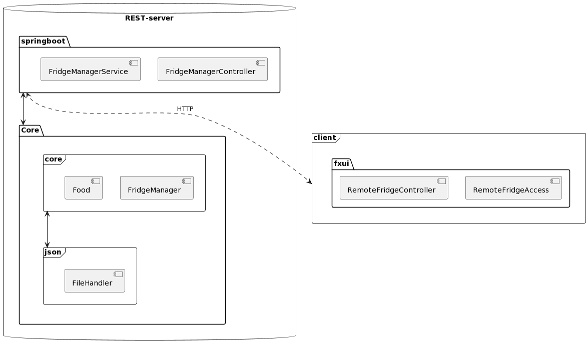

Fridge-Manager
=
<u>**Beskrivelse av programmet:**</u>
Dette er et program som holder styr på hva man har i kjøleskapet.

Den skal holde styr på produktene i kjøleskapet, samt tilhørende informasjon slik som antall, enhet, utløpsdato og eier. Den skal kunne vise en bruker hvilke produkter som snart går ut på dato, slik at disse blir brukt opp før de blir dårlige. Det skal også være mulig å både legge til og fjerne produkter fra kjøleskapet. Forhåndsvisning av programmet og dets struktur kan sees under:

**Klassediagram med oversikt over appens struktur:**    
      

**Illustrasjonsbilde av appens brukergrensesnitt**       
        

**Sekvensdiagram som viser et vanlig brukseksempel**           
      

**Arkitekturdiagram:**           
     

I dette dokumentet samles prosjektets brukerhistorier. Brukerhistorier er der slik at vi i utviklingsteamet kan utforme krav systemet må tilfredstille fra brukerens perspektiv.

Brukerhistorier
=

<u>**Brukerhistorie 1**</u>
Som privatperson ønsker jeg å holde oversikt og orden på varene i kjøleskapet,
slik at jeg vet hva jeg har og unngår matsvinn.

Brukeren har behov for å holde oversikt over innholdet i kjøleskapet og fryseren. Dette er nødvendig slik at matvarer med kort levetid kan benyttes før de går ut på dato. Det er også hensiktsmessig med en oversikt over hvem som eier matvaren, samt den gjenværende mengden.

<u>Viktig å kunne se</u>
-
- Oversikt over innholdet i kjøleskapet og fryseren
- Oversikt over:
	- Mengden igjen av matvaren
	- Utløpsdato på matvaren (Slik at varer med kort levetid kan benyttes først)
	- Enheten tilknyttet matvaren
	- Hvem matvaren tilhører
	

<u>Viktig å kunne gjøre</u>
-
- Legge til varer med tilhørende informasjon som:
	- Utløpsdato
	- Enhet
	- Eier av matvaren
	- Mengde av matvaren
- Hente ut deler av, eller hele varen

<u>**Brukerhistorie 2**</u>      
I kollektivet vårt deler vi kjøleskap. Jeg tror at FridgeManager vil løse nesten alle våre kjøleskapstilknyttede utfordringer. Jeg ønsker imidlertid at alle skal kunne bruke programmet på hver sin enhet, slik at vi slipper å dele en felles PC.     
Ettersom brukeren ønsker at flere klienter skal kunne ha tilgang til den samme dataen, må sentral lagring benyttes. Det vil f.eks. egne seg godt med en server der dataen blir lagret. Serveren kan så bruke en REST-API til å kommunisere med flere klienter. Disse klientene vil da kunne lese og manipulere den samme dataen. 
-

<u>Viktig å kunne gjøre</u>
- Lese fra fil
- Skrive til fil
- Opprette ny fil
- Slette fra fil