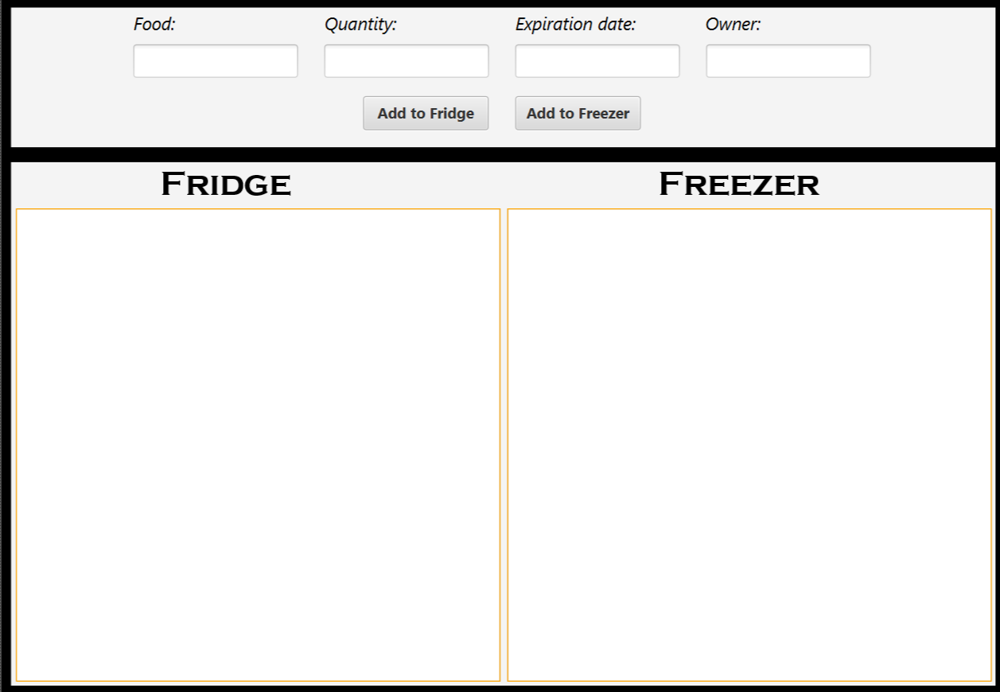

Fridge Manager
=
Dette er et program som holder styr på hva man har i kjøleskapet.

Den skal holde styr på produktene i kjøleskapet, samt tilhørende informasjon slik som utløpsdato og eier. Den skal kunne vise en bruker hvilke produkter som snart går ut på dato, slik at disse blir brukt opp før de blir dårlige. Det skal også være mulig å både legge til og fjerne produkter fra kjøleskapet. Forhåndsvisning av programmet kan sees under: 

Prosjektets brukerhistorier kan hentes [her](brukerhistorier.md)
